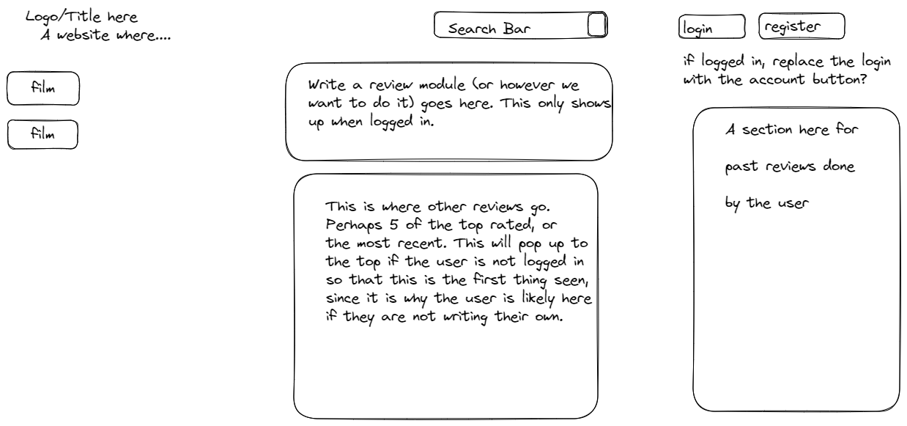
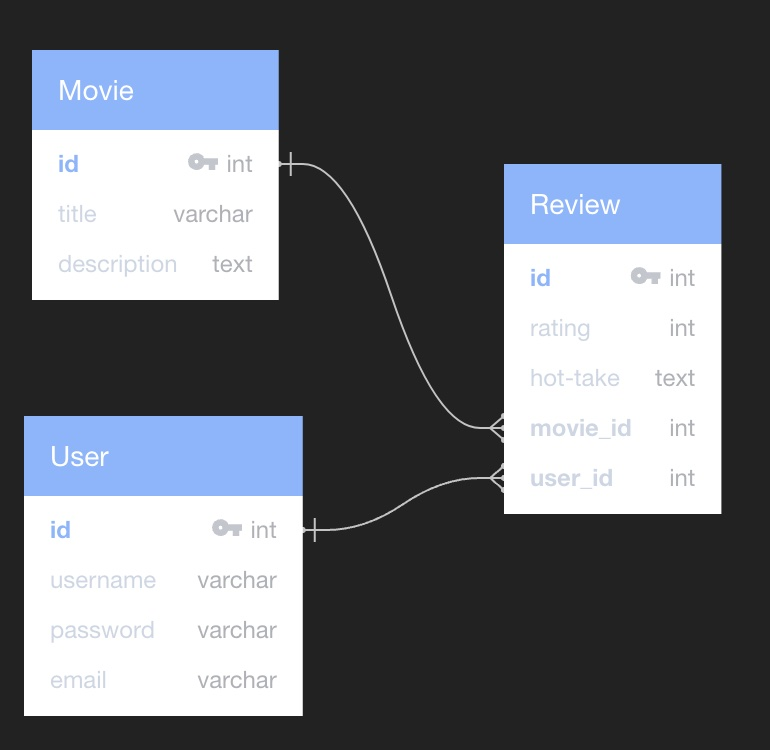

  # Hot Takes

  ## Table of Contents
  - [Description](#Description)
  - [Usage](#Usage)
  - [Installation](#Installation)
  - [User Story](#user-story)
  - [License](#License)
  - [Contributing](#Contributing)
  - [Tests](#Tests)
  - [Questions](#Questions)
  - [Wireframes](#wireframes-of-application)
  - [Screenshot](#screenshot-of-application)
  - [Presentation](#Presentation-slides)

  ## Description
  An interactive movie-review site for the hot takes of real movie goers, not critics!

  ## Usage
  In a web browser, go to https://hot-takes-reviews-b29812e3e846.herokuapp.com/ to sarch movies, user ratings and reviews. Sign up or login to add your own "hot takes" on your favorite movies or interact with other user reviews. Add a "heat up" vote on reviews you think are great or a "cool down" vote for reviews you don't care for. 
  
  ## Installation
  NA

  ## User Story
  As a casual movie viewer I would like an application to visit where peer reviews will be available for movies I've seen. When I load the application I will be prompted with a landing page that has a search bar functionality and a review section. Within a navbar will be a sign in feature for users to sign into their account. Upon logging in a table of past reviews will appear. Upon searching for a new movie a list of top rated reviews will appear along with a text area where a new review can be added. Upon submission of your review other users will have the ability to upvote or downvote your review. By adding the feature of upvote/downvote users will be able to better gauge if a movie will be within their liking.

  ## Questions
  contact GitHub users ACFcoding, b-connolly, ctowns5, DSStad or OutlawDisco for questions

  ## Contributing
  ACFcoding, b-connolly, ctowns5, DSStad, OutlawDisco, Font Awesome, Free Front-end, and Paul.

  ## Tests
  NA

  ## License
  Licensed under the [MIT](https://opensource.org/licenses/MIT) license
  
  
  ## Wireframes of application
  
  
  
  

  ## Screenshot of application
  

  ## Database diagram of project DB 
  

  ### link to deployed application: https://hot-takes-reviews-b29812e3e846.herokuapp.com/

  ### GitHub repository: https://github.com/OutlawDisco/Hot-Takes

  ## Presentation slides
  
  
  
  
  
  
